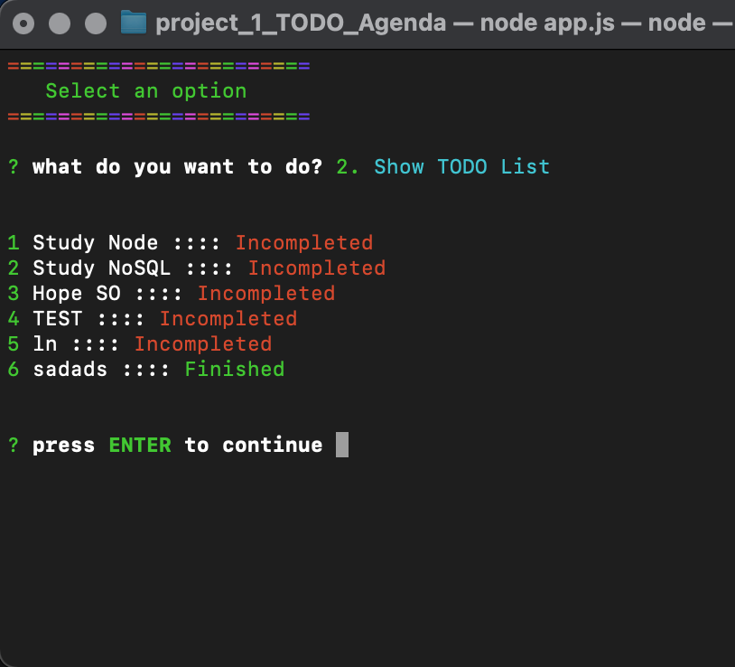
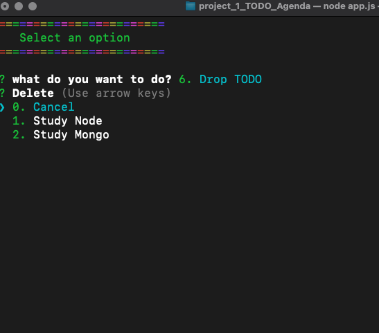

## TODO Console Agenda
<<<<<<< HEAD

=======

>>>>>>> feature/app

## Project build in node
run npm i to download all dependencies 

## Dependencies
<<<<<<< HEAD
colors
=======
- colors,
- inquirer,
- uuid,
>>>>>>> feature/app
